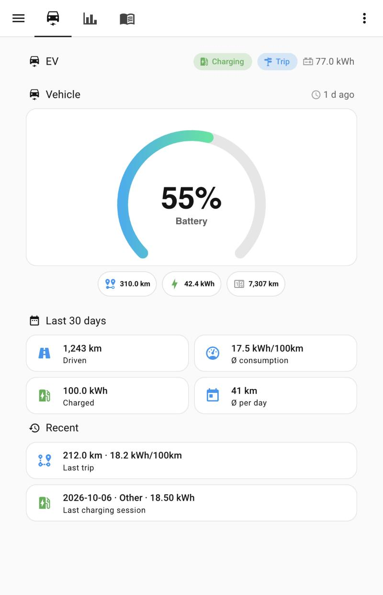
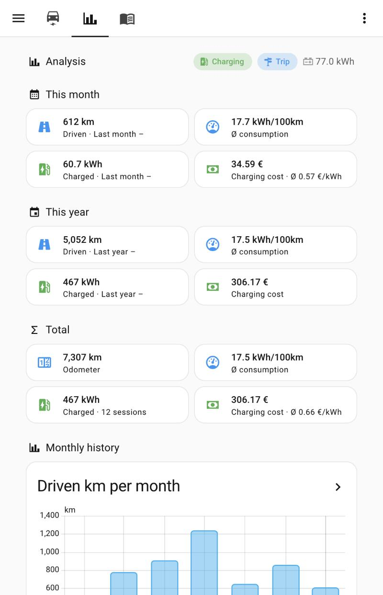
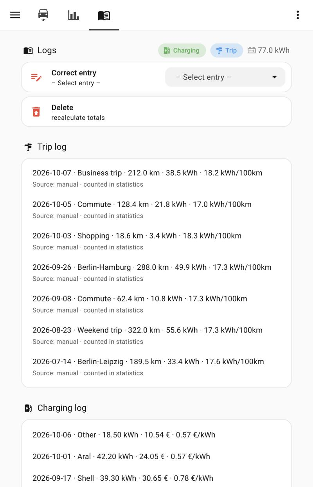
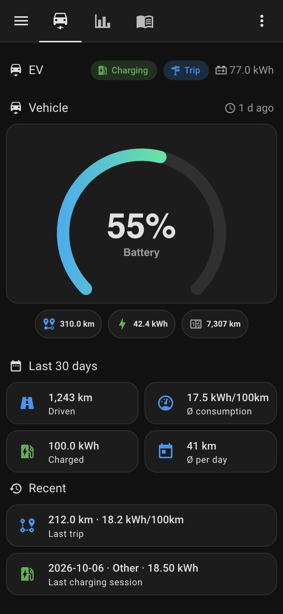

# ha-vw-evcc-tracker

🇩🇪 [Deutsche Version](README.de.md)

Track the mileage, battery level, consumption and charging of a **Volkswagen Group electric car** (built and tested with a VW ID.7) in **Home Assistant** – using the official **VW EU Data Act portal** as the data source and **evcc** as the bridge.

> **Status: work in progress, shared for feedback.** This started as a private setup and is being turned into a guide. It is an example, not a product: **no support, use at your own risk.** Ideas, corrections and questions are very welcome – please open an issue or a discussion.

## What it does

- Reads battery level (SoC), range and odometer of the car from VW's EU Data Act portal (data delivery every 15 minutes) through evcc.
- Shows them in Home Assistant and calculates trips and consumption automatically whenever the odometer changes.
- Logs charging sessions (public charging) and trips in two to-do lists, with monthly/yearly totals, costs and a 30-day view.
- Lets you enter charging sessions and trips by **Telegram bot** (also away from home, without VPN) or by dashboard buttons.
- Comes with a three-tab dashboard (Now · Analysis · Logs) that works on phone, tablet and desktop, in light and dark mode.

## Screenshots

All screenshots show **invented example data** from a test installation (light mode; the last one is the phone view in dark mode).

| Now | Analysis | Logs | Phone (dark) |
|---|---|---|---|
|  |  |  |  |

## How it works

```
VW EU Data Act portal (data request, every 15 min)
        │
        ▼
      evcc  (virtual charge point, demo charger, mode "off")
        │
        ▼
 Home Assistant  ──►  automations / scripts / helpers  ──►  dashboard
        ▲
        └── Telegram bot (enter charging sessions and trips)
```

Important: this setup has **no wallbox**. evcc is used only as a data source for the car. The virtual charge point must stay a *demo charger in mode "off"* – never use a charger type that can control the vehicle.

## Guides

| # | Guide | Status |
|---|---|---|
| 1 | [VW EU Data Act portal: request your car's data](docs/en/01-vw-eu-data-act-portal.md) · [DE](docs/de/01-vw-eu-data-act-portal.md) | draft |
| 2 | [evcc: install and configure](docs/en/02-evcc.md) · [DE](docs/de/02-evcc.md) | draft |
| 3 | [Telegram bot](docs/en/03-telegram.md) · [DE](docs/de/03-telegram.md) | draft |
| 4 | [Home Assistant: helpers, scripts, automations, dashboard](docs/en/04-home-assistant.md) · [DE](docs/de/04-home-assistant.md) | draft |
| 5 | [Troubleshooting](docs/en/05-troubleshooting.md) · [DE](docs/de/05-troubleshooting.md) | draft |

## Requirements

- Home Assistant (tested with 2026.9 on Home Assistant OS)
- evcc (tested with 0.316)
- A Volkswagen Group vehicle with an online connection and access to the EU Data Act portal
- HACS cards for the dashboard: Mushroom, card-mod, ApexCharts card, Plotly graph card
- Optional: a Telegram bot for entering data away from home

## License

[MIT](LICENSE). Volkswagen, evcc, Home Assistant and Telegram are trademarks of their respective owners; this project is not affiliated with any of them.
